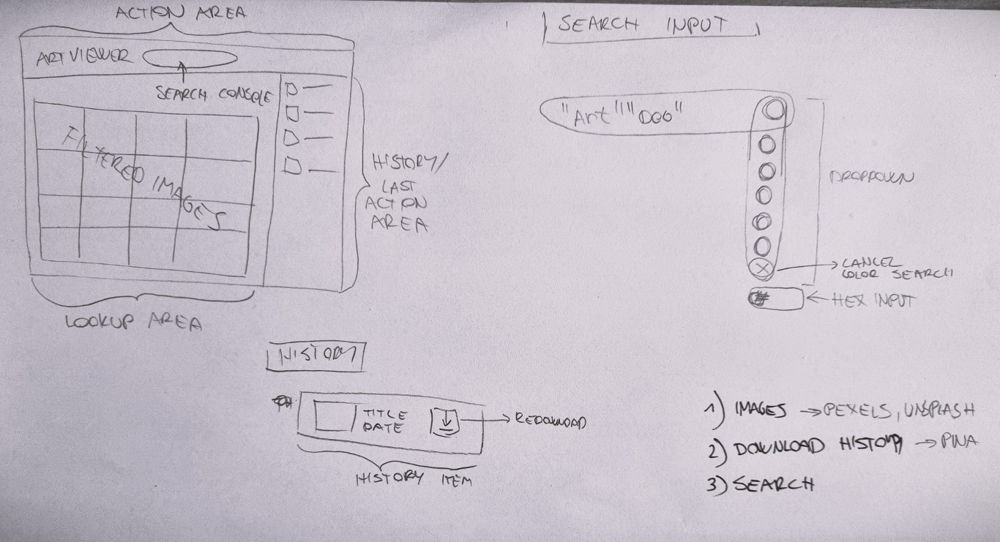
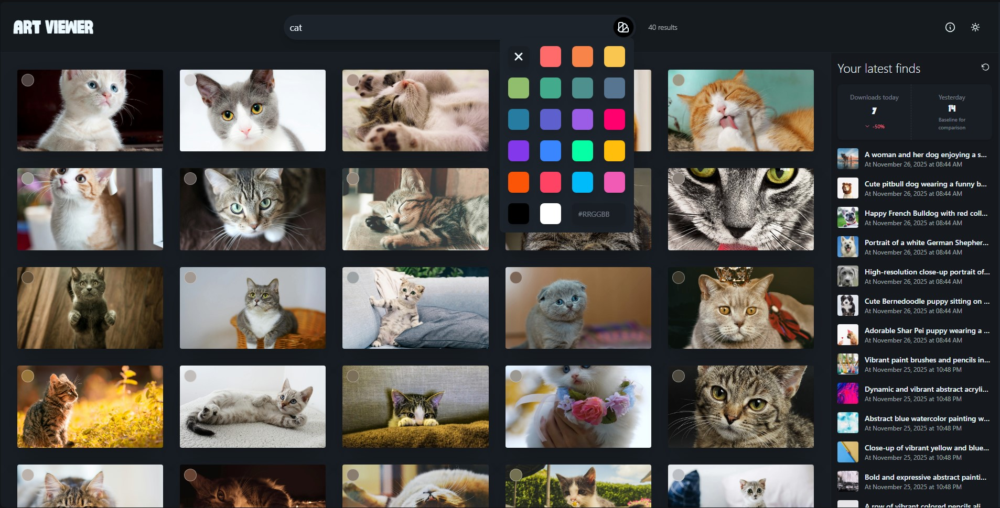

## Art Previewer – Inspiration Browser for Artists & Designers
Netlify preview (not thorough testing yet): https://artpreviewer.netlify.app

Art Previewer is a lightweight tool built with **Vue 3**, **TypeScript**, **Pinia**, **Vite**, **Tailwind** and **daisyUI**.  
It is designed specifically for **artists and designers** who need a fast, organic way to explore visual ideas without a lot of UI noise.

I made a deliberate assumption that this tool will be used in creative workflows where attention should stay on the images, not on complex controls.  
That’s why the experience is intentionally simple: search by **keywords**, refine by **color palettes**, and grab assets via **drag-and-drop / one-click download** for a smoother workflow.
Another assumption I made is that this tool will be used by designers at companies that already have many assets in their libraries with some metadata. That’s why the application does not handle asset uploads or metadata management.

## How it began


Everything started on a piece of paper. With some brainstomring and my wifes suggestions I created initial lalyout idea that you can see above.

## Current state



This is the current state of the application with all of the features implemented.


## How it works

User can search for images by keywords, filter by color palettes and download the image.
User can also filter images with their custom hex color. For convenience, each image also has an average color swatch that can be clicked to copy the hex color to clipboard.
User can download the image by clicking the download button or by dragging the image to a compatible target (e.g. desktop or design tools) using a `DownloadURL` payload for quick transfer.
User can also see the history of their downloads in the sidebar.
Of course there is a dark mode available for all of the hardcore designers. 


## Core Features

- **Keyword-based Search**
  - Global search bar powered by the Pexels API (`brains.ts` store).
  - Debounced search for responsive typing without spamming the API.
  - Live feedback: *“Searching…”*, error messages, and total result count.

- **Smart Color Palette Filter**
  - Compact color picker in the search bar (`App.vue`).
  - Curated palette of accent colors plus support for a **custom hex input** (e.g. `#ff6b6b`).
  - Color similarity is computed in **LAB color space** with a tolerance (`COLOR_TOLERANCE` in `brains.ts`) so results feel visually close, not just exact hex matches.

- **Image Grid & Card Interactions**
  - Responsive image grid (`ImageGrid.vue`) rendering images as `ImageCard` components.
  - Each card (`ImageCard.vue`) shows:
    - Large thumbnail (`photo.src.large2x`) with clean, minimal framing.
  - **Average color chip** on each image:
    - Displays the image’s average color.
    - Click to **copy the hex color** to clipboard, with a small “Copied” confirmation.

- **Fast Download & Drag-and-Drop Workflow**
  - Click an image to **download** the original file.
  - **Drag the image card** to compatible targets (e.g. desktop or design tools) using a `DownloadURL` payload for quick transfer.
  - Download status on each card:
    - Loading overlay with spinner and “Downloading…” text.
    - Error state with message and **Retry** button on the card.

- **Download History Sidebar**
  - A dedicated `HistorySidebar.vue` shows your previously downloaded images.
  - Uses a persisted `downloadHistory` in the `brains.ts` Pinia store so your history survives page reloads.
  - Latest downloads are always at the top; history is trimmed to a reasonable length to stay lightweight.

- **Organic, Focused UI**
  - Minimal chrome: main focus is the search bar, color control, and image grid.
  - Clean typography with the **Outfit7** typeface defined in `style.css`.
  - Tailwind + daisyUI for fast but consistent styling, with smooth hover and interaction states.

---

## Technology Stack

- **Vue 3** with `<script setup>` SFCs
- **TypeScript**
- **Pinia** for state management (`brains.ts`)
- **Vite** for bundling / dev server
- **Tailwind CSS** + **daisyUI** for styling
- **LAB color space** for color similarity calculation
- **Pexels API** for image search and download

You’ll need a **Pexels API key** exposed as `VITE_PEXELS_API_KEY` in your environment for the app to load images.

---

## Running the App

```bash
npm install
npm run dev
```

Then open the local URL from the terminal in your browser.

**Important!** You need to create a `.env` file in the root directory and add your Pexels API key to it. 

---

## Testing

This project uses **Vitest** for unit tests.

- **Store tests**: there is a basic test suite for the `brains` Pinia store (`brains.test.ts`) that checks:
  - Initial state (defaults for query, photos, history, color filter).
  - `performSearch` success behavior using a mocked Pexels response.
  - Download history updates and color filter logic.
- The store’s initial API call is disabled when `import.meta.env.MODE === 'test'` so tests do not hit the real Pexels API.

To run the tests:

```bash
npm test         # run once
npm run test:watch  # watch mode during development
```